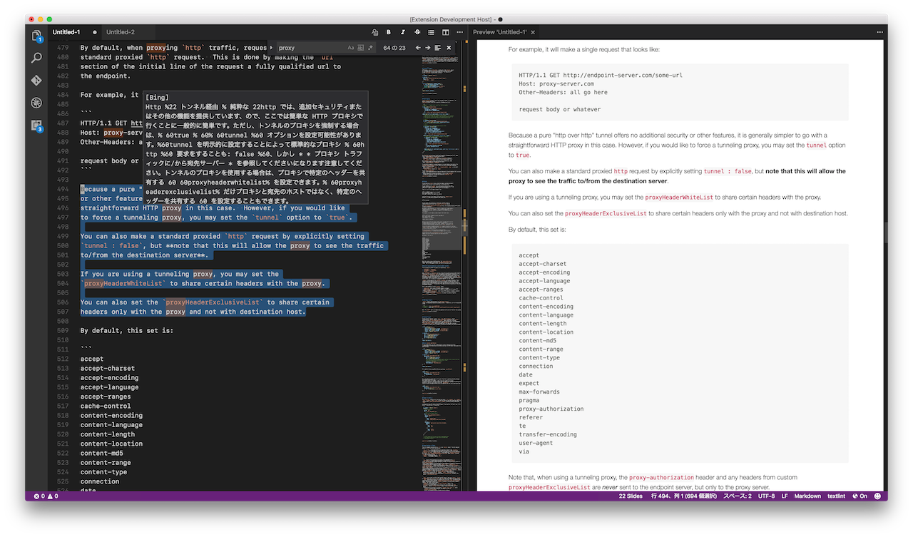

# TranslationToolbox README

## 使い方

選択した文字または文字列を、英語から日本語へ翻訳し、結果を Hover 表示します。

拡張機能を読み込んだら、翻訳させた単語あるいは文を選択します。選択されたテキスト上にカーソルこ重ねるか、`cmd+K cmd+I` または、コマンドパレットから`ホバーの表示 (Show Hover)` を実行すると、翻訳結果が hover として表示されます。

* オリジナルの TranslationToolbox 拡張機能では、ショートカットキーでコマンドを有効にするようになっていますが、これは拡張機能が activate されると同時に有効になります。
選択したものが、翻訳や対象として送信されるので注意してください

* また、proxy 経由でもアクセスできるようになっています。実験的ではありますが、settings.json の設定から proxy を取得します。

Original:

* <https://github.com/wly2014/TranslationToolbox>
* <https://marketplace.visualstudio.com/items?itemName=WLY.translationtoolbox>
## TranslationToolbox README

翻译工具箱，使得文本翻译更加方便快捷，启用快捷键： `ctrl+alt+t or cmd+alt+t`

## Features

整合了百度，Google，Bing，以及有道翻译等翻译工具，使翻译结果更具有参考性。支持**选中即翻译**

## Quick Start

* 安装该扩展
* 使用快捷键 `ctrl+alt+t or cmd+alt+t` 启用TranslationToolbox扩展
* 选中想要翻译的文本，并将**鼠标移至其上**，即可显示翻译结果

## Release Notes

### 0.0.1

发布第一版

> 整合了**百度，Google，Bing，及有道**翻译的相关API
> 支持**选中即可翻译**

## Source

[GitHub](https://github.com/wly2014/TranslationToolbox)

                
## License

[MIT](https://raw.githubusercontent.com/DonJayamanne/pythonVSCode/master/LICENSE)

-----------------------------------------------------------------------------------------------------------